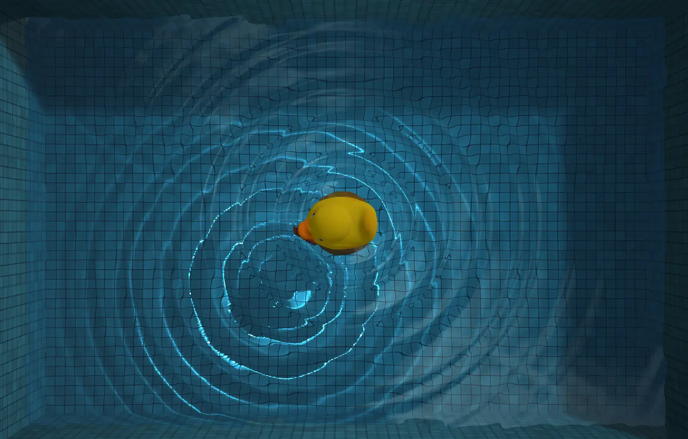

# Poolcore Water Demo

> A **Poolcore / Cleancore** aesthetic visual experience built with Three.js and WebGL 2.0.

## 🌊 Overview

**Poolcore Water Demo** creates a serene, liminal space directly in your browser. It is a modernized re-interpretation of the classic [WebGL Water](http://madebyevan.com/webgl-water/) demo, shifted towards a **Poolcore** & **Cleancore** aesthetic.

By leveraging **WebGL 2.0** and **Three.js**, this project simulates a pristine, sun-drenched tiled pool with hyper-realistic water physics, refractions, and caustics, designed to evoke a sense of calm and nostalgic surrealism.

## ✨ Key Features

- **Poolcore Aesthetics**: Crystal clear water, pristine tiles, and bright, ethereal lighting reminiscent of liminal spaces.
- **High-Fidelity Rendering**: Real-time **caustics**, **refractions**, and **soft shadows** powered by WebGL 2.0 floating-point textures.
- **Modern Tech Stack**: Written in **TypeScript**, using **Three.js** for rendering and a custom physics implementation.
- **Cross-Platform Zen**: Optimized for both desktop relaxation and mobile interaction (supports touch & gravity sensors).
- **Interactive Fluidity**:
  - Touch and drag to create ripples in the stillness.
  - Interact with floating objects (like the classic rubber duck) that bob with buoyancy.

## 🎮 Controls

- **Click/Touch**: Disturb the surface and create ripples.
- **Drag**: Guide the floating duck through the water.
- **Orbit**: Rotate your view around the pool.

## 🦄 CREDITS

This project is a tribute to and evolution of the work by [Evan Wallace](http://madebyevan.com).

- Original Repo: [evanw/webgl-water](https://github.com/evanw/webgl-water)
- Original Demo: [http://madebyevan.com/webgl-water/](http://madebyevan.com/webgl-water/)

## 📄 License

MIT License © 2025-PRESENT [Del Wang](https://del.wang)
